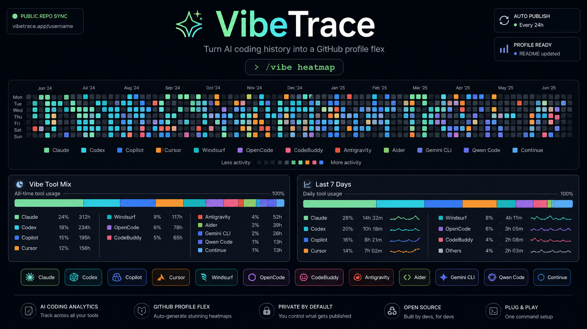
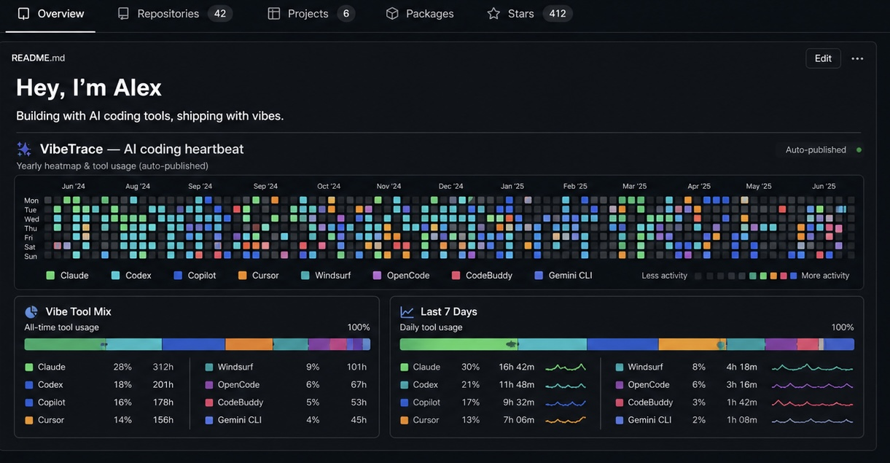

<div align="center">



<br>

[](https://opensource.org/licenses/MIT)
[](https://claude.ai/claude-code)
[](https://github.com/Li-xingXiao/VibeTrace)

**Your GitHub contribution graph only tells half the story. VibeTrace tells the rest.**

**GitHub 贡献图只讲了一半的故事。VibeTrace 讲另一半。**

[English](#what-is-vibetrace) · [中文](#vibetrace-是什么) · [Quick Start](#quick-start--快速开始)

</div>

---

## What is VibeTrace?

A **Claude Code skill** that turns your local AI coding history into a GitHub-style heatmap and publishes it directly to your GitHub profile. No manual data entry, no third-party services — it reads your local conversation logs and generates everything automatically.

It generates:

- **🗓️ Yearly Activity Heatmap** — a GitHub-style contribution grid, but for AI coding. Each cell is color-coded by which tool you used that day — Claude, Codex, Copilot, Cursor, and more
- **📊 Vibe Tool Mix Card** — a WakaTime-style all-time tool usage breakdown with percentages and total hours
- **⚡ Last 7 Days Card** — recent daily usage with sparkline charts so you can see your coding rhythm
- **🔒 Safe README Updates** — only touches the `<!-- vibe-heatmap:start -->` marker block. Your existing profile content is never overwritten
- **🔌 15 AI Tools Supported** — Claude, Codex, CodeFuse, OpenCode, CodeBuddy, Antigravity, GitHub Copilot, Cursor, Windsurf, Continue, Aider, Gemini CLI, Qwen Code, and custom sources
- **🏅 12 Coding Achievements** — streak badges (3-day to 100-day), activity milestones, marathon sessions, multi-tool diversity, and time-pattern awards. Earned badges glow; locked ones stay dimmed with progress hints

> **Why from local history?** Cloud-based trackers require API keys, browser extensions, or telemetry opt-ins. VibeTrace reads the conversation logs already sitting on your machine — zero setup overhead, zero data leaving your laptop.

---

## VibeTrace 是什么？

一个 **Claude Code 技能**，把你本地的 AI 编程历史变成 GitHub 风格的热力图，直接发布到你的 GitHub 个人主页。不需要手动录入数据，不需要第三方服务——它读取你本地的对话日志，自动生成一切。

它会生成：

- **🗓️ 年度活动热力图** — GitHub 风格的贡献格子，但记录的是你的 AI 编程活动。每个格子按你当天使用的工具着色——Claude、Codex、Copilot、Cursor 等
- **📊 工具混合卡片** — 类似 WakaTime 的全时段工具使用分布，包含百分比和总时长
- **⚡ 最近 7 天卡片** — 近期每日使用量，配有迷你折线图展示你的编程节奏
- **🔒 安全的 README 更新** — 只替换 `<!-- vibe-heatmap:start -->` 标记块，你已有的个人主页内容绝不会被覆盖
- **🔌 支持 15 种 AI 工具** — Claude、Codex、CodeFuse、OpenCode、CodeBuddy、Antigravity、GitHub Copilot、Cursor、Windsurf、Continue、Aider、Gemini CLI、Qwen Code，以及自定义数据源
- **🏅 12 个编程成就** — 连续打卡徽章（3 天到 100 天）、活跃天数里程碑、马拉松编程、多工具使用、时间模式奖章。已获得的徽章高亮显示，未解锁的灰显并提示进度

> **为什么用本地历史？** 云端追踪器需要 API Key、浏览器插件或遥测授权。VibeTrace 直接读取你电脑上已有的对话日志——零额外配置，数据零外传。

---

**Input:** Your local AI coding history files — `~/.claude/history.jsonl`, `~/.codex/history.jsonl`, and more (read-only, never sent anywhere)

**Output:**

| Output | What you get |
|--------|-------------|
| 🗓️ Heatmap SVG | GitHub-style yearly grid, color-coded by tool |
| 📊 Tool Mix SVG | All-time usage breakdown with percentages and hours |
| ⚡ Recent SVG | Last 7 days usage with sparkline charts |
| 📄 JSON Stats | Machine-readable stats for automation |
| 🏅 Badges SVG | 12 coding achievements — earned or locked |
| 🪙 Token SVG | Token economy breakdown by model |
| 📋 Scorecard SVG | Messages, streaks, sessions, vibe power |
| 📝 Profile README | Auto-updated with safe marker block replacement |

<div align="center">

**📸 What it looks like on your GitHub profile / 在 GitHub 主页上的效果**



<sub>A real GitHub profile with VibeTrace — heatmap + tool mix + recent activity / 一个使用了 VibeTrace 的 GitHub 主页</sub>

</div>

---

## Quick Start / 快速开始

**Claude Code (marketplace):**

```bash
# Step 1: Add marketplace
/plugin marketplace add Li-xingXiao/VibeTrace

# Step 2: Install
/plugin install vibetrace@vibetrace

# Step 3: Link your GitHub account
/vibe set github=<your-github-username>

# Step 4: Generate and publish
/vibe heatmap
```

**Claude Code (manual):**

```bash
git clone https://github.com/Li-xingXiao/VibeTrace.git
cd VibeTrace
scripts/install.sh --target claude
# Then in Claude Code:
/vibe set github=<your-github-username>
/vibe heatmap
```

**For Codex:**

```bash
scripts/install.sh --target codex
# or both:
scripts/install.sh --target both
```

---

## GitHub Account Association / GitHub 账号关联

This is the most important setup step. VibeTrace needs to know your GitHub username so it can find (or create) your `<username>/<username>` profile repository and push updates to it.

这是最重要的配置步骤。VibeTrace 需要知道你的 GitHub 用户名，才能找到（或创建）你的 `<username>/<username>` 个人主页仓库并推送更新。

### The Basics / 基本用法

```bash
/vibe set github=<your-github-username>
```

That's it for most users. VibeTrace will:

1. Check if `<username>/<username>` repo exists on GitHub
2. If not, automatically create it (tries `gh` CLI first, then GitHub API)
3. Clone the repo locally to `$HOME/<username>`
4. Configure git author info from your global git config

对大多数用户来说这一条命令就够了。VibeTrace 会自动检查仓库是否存在、创建仓库、克隆到本地、配置 git 信息。

### Authentication Methods / 认证方式

VibeTrace supports **3 authentication methods**, tried in order automatically. You only need to worry about this if the default doesn't work.

VibeTrace 支持 **3 种认证方式**，会按顺序自动尝试。只有默认方式不行时你才需要关心这个。

#### Method 1: SSH (Default) / 方式一：SSH（默认）

```bash
/vibe set github=alice
```

Uses your existing SSH key (`~/.ssh/id_rsa` or `~/.ssh/id_ed25519`) to authenticate with GitHub. **This is the recommended method** if you already have SSH keys set up with GitHub.

使用你现有的 SSH 密钥进行 GitHub 认证。**如果你已经配置了 SSH 密钥，这是推荐方式。**

Requirements / 要求:
- SSH key added to your GitHub account ([GitHub SSH docs](https://docs.github.com/en/authentication/connecting-to-github-with-ssh))
- `git@github.com` accessible from your machine

#### Method 2: GitHub CLI (`gh`) / 方式二：GitHub CLI

If SSH isn't set up, VibeTrace automatically tries to use the GitHub CLI. It will:

1. **Auto-install `gh`** if missing — tries `apt`, user-local binary, `brew`, `dnf`, `yum`, `zypper`, `pacman` in order
2. **Auto-authenticate** via `gh auth login` if not logged in
3. Create the profile repo with `gh repo create`

如果 SSH 没配置，VibeTrace 会自动尝试 GitHub CLI。它会自动安装 `gh`（如果没有）、自动登录、然后创建仓库。

No extra configuration needed — VibeTrace handles everything. You just need to follow the browser-based OAuth flow when `gh auth login` opens.

无需额外配置——VibeTrace 会自动处理一切。你只需要在 `gh auth login` 打开浏览器时完成 OAuth 授权。

#### Method 3: HTTPS + Personal Access Token (PAT) / 方式三：HTTPS + 个人访问令牌

If both SSH and `gh` fail (e.g., restricted environments, corporate firewalls), use a GitHub PAT:

如果 SSH 和 `gh` 都不行（比如受限环境、公司防火墙），使用 GitHub PAT：

**Step 1:** Create a PAT with `public_repo` scope:

```
https://github.com/settings/tokens/new?scopes=public_repo&description=VibeTrace%20profile%20repo%20setup
```

**Step 2:** Set the token as an environment variable and run setup:

```bash
# Option A: Use the default env var name
export VIBE_GITHUB_TOKEN=ghp_xxxxxxxxxxxx
/vibe set github=alice

# Option B: Use GITHUB_TOKEN (also works as fallback)
export GITHUB_TOKEN=ghp_xxxxxxxxxxxx
/vibe set github=alice

# Option C: Specify a custom env var
export MY_TOKEN=ghp_xxxxxxxxxxxx
/vibe set github=alice auth=https_pat token_env=MY_TOKEN
```

**Step 3:** Explicitly set HTTPS PAT mode:

```bash
/vibe set github=alice auth=https_pat
```

For more on creating PATs, see [GitHub PAT docs](https://docs.github.com/en/authentication/keeping-your-account-and-data-secure/managing-your-personal-access-tokens).

### Full Setup Options / 完整配置选项

```bash
# Minimal (SSH, auto-detect everything)
/vibe set github=alice

# Explicit SSH with custom local path
/vibe set github=alice repo=~/projects/alice auth=ssh

# HTTPS PAT with custom git author info
/vibe set github=alice auth=https_pat token_env=MY_TOKEN name="Alice Dev" email=alice@example.com

# Check your current config
/vibe config
```

### Troubleshooting / 常见问题

| Problem | Solution |
|---------|----------|
| `Permission denied (publickey)` | SSH key not added to GitHub. Use `auth=https_pat` instead, or add your SSH key |
| `gh auth login` fails in headless env | Use `auth=https_pat` with a PAT |
| Repo creation fails | Check if `<username>/<username>` already exists on GitHub |
| Push rejected | Make sure you have write access to the profile repo |
| `gh: command not found` after install | Restart your shell or run `export PATH="$HOME/.local/bin:$PATH"` |

---

## Supported Tools / 支持的工具

VibeTrace auto-detects history files for these tools. Only tools with detectable local history are rendered — no empty entries.

| Tool | History Path | Color |
|------|-------------|-------|
| Claude | `~/.claude/history.jsonl` | 🟢 Green |
| Codex | `~/.codex/history.jsonl` | 🔵 Cyan |
| CodeFuse | `~/.codefuse/engine/*/history.jsonl` | 🟣 Purple |
| OpenCode | `~/.local/share/opencode/**/*.json*` | 🟣 Purple |
| GitHub Copilot | Custom path via `history=` | 🔵 Blue |
| Cursor | Custom path via `history=` | 🟠 Orange |
| Windsurf | Custom path via `history=` | 🟢 Teal |
| CodeBuddy | Custom path via `history=` | 🩷 Pink |
| Continue | Custom path via `history=` | - |
| Aider | Custom path via `history=` | - |
| Gemini CLI | Custom path via `history=` | 🔵 Blue |
| Qwen Code | Custom path via `history=` | - |
| Antigravity | Custom path via `history=` | - |

For tools without auto-detected paths, provide the history file explicitly:

```bash
/vibe heatmap source=copilot history=~/.copilot/history.jsonl
/vibe heatmap source=cursor history=~/.cursor/history.jsonl
/vibe heatmap source=codebuddy history=~/.codebuddy/history.jsonl
```

---

## Commands / 命令

| Command | What it does |
|---------|-------------|
| `/vibe set github=<user>` | Set up GitHub profile association (one-time) |
| `/vibe config` | Show saved configuration |
| `/vibe heatmap` | Generate heatmap + tool cards, commit, and push |
| `/vibe heatmap --source <tool>` | Generate for a single tool only |
| `/vibe heatmap source=<tool> history=<path>` | Generate with a custom history source |
| `/vibe heatmap --no-push` | Commit only, skip push |
| `/vibe heatmap --no-commit` | Generate files only, no git operations |
| `/vibe heatmap --recent-days 14` | Change the recent card window (default: 7) |
| `/vibe heatmap --intensity-mode sessions` | Intensity by sessions instead of minutes |
| `/vibe auto` | Show auto-publish status (cron + session hook) |
| `/vibe auto enable` | Enable daily auto-publish via system crontab |
| `/vibe auto enable weekly` | Preset: every Monday at 9am |
| `/vibe auto enable 6h` | Preset: every 6 hours |
| `/vibe auto enable "<cron>"` | Custom cron schedule, e.g. `"0 */12 * * *"` |
| `/vibe auto disable` | Remove the auto-publish crontab entry |

---

## How It Works / 工作流程

```
/vibe set github=alice          /vibe heatmap
        │                              │
        ▼                              ▼
┌──────────────────┐     ┌──────────────────────────┐
│  GitHub Setup    │     │  Read Local History       │
│  ─────────────   │     │  ──────────────────       │
│  • Check/create  │     │  • ~/.claude/history.jsonl│
│    profile repo  │     │  • ~/.codex/history.jsonl │
│  • Clone locally │     │  • ~/.codefuse/engine/... │
│  • Configure git │     │  • Custom sources         │
└──────────────────┘     └──────────┬───────────────┘
                                    │
                                    ▼
                         ┌──────────────────────────┐
                         │  Build Sessions           │
                         │  ──────────────           │
                         │  • 25-min idle gap split  │
                         │  • Detect tool source     │
                         │  • Calculate active mins  │
                         └──────────┬───────────────┘
                                    │
                                    ▼
                         ┌──────────────────────────┐
                         │  Generate SVGs            │
                         │  ──────────────           │
                         │  • Yearly heatmap grid    │
                         │  • Tool mix card          │
                         │  • Recent activity card   │
                         │  • JSON stats             │
                         └──────────┬───────────────┘
                                    │
                                    ▼
                         ┌──────────────────────────┐
                         │  Publish to GitHub        │
                         │  ──────────────────       │
                         │  • Update README marker   │
                         │  • Commit & push          │
                         └──────────────────────────┘
```

---

## Files Written to Your Profile Repo / 写入到个人主页仓库的文件

```
<username>/<username>/
├── README.md                          # Updated (marker block only)
└── assets/
    ├── vibe-heatmap.svg               # Yearly activity heatmap
    ├── vibe-tools.svg                 # All-time tool usage card
    ├── vibe-tools-recent.svg          # Last 7 days card
    ├── vibe-tokens.svg                # Token economy by model
    ├── vibe-scorecard.svg             # Vibe scorecard
    ├── vibe-badges.svg                # Coding achievements card
    └── vibe-heatmap.json              # Machine-readable stats
```

Your existing `README.md` content is always preserved. VibeTrace only replaces the content between:

```markdown
<!-- vibe-heatmap:start -->
...this part gets updated...
<!-- vibe-heatmap:end -->
```

If the markers don't exist yet, VibeTrace appends them to the end of your README. If `README.md` doesn't exist, it creates a minimal profile template.

---

## Privacy / 隐私

- Only reads **local** history files — nothing is sent to external services
- All processing happens inside your Claude Code session
- API keys, tokens, passwords, and PII are never included in generated outputs
- History files are read-only — VibeTrace never modifies your conversation logs

---

## Requirements / 环境要求

- Claude Code or Codex (this is a skill for either)
- Some AI coding history on your local machine
- A GitHub account (for publishing to your profile)
- That's it. No API keys, no accounts, no extra dependencies.

---

## Roadmap

- [x] GitHub-style yearly heatmap with multi-tool color coding
- [x] WakaTime-style tool usage cards (all-time + recent)
- [x] 15 AI coding tool support with auto-detection
- [x] Safe README marker block updates
- [x] SSH, GitHub CLI, and HTTPS PAT authentication
- [x] Auto-install `gh` CLI across 6 package managers
- [x] Auto-create profile repo if missing
- [x] Custom JSON/JSONL history sources
- [x] Configurable intensity modes (minutes/sessions/events)
- [x] Session detection with idle gap analysis
- [x] Scheduled auto-publish (daily/weekly cron + session-start hook)
- [x] Badge/achievement system for coding streaks

---


<div align="center">

**Your GitHub profile shows what you shipped. VibeTrace shows how you built it.**

**GitHub 主页展示你发布了什么。VibeTrace 展示你是怎么构建的。**

<br>

</div>
